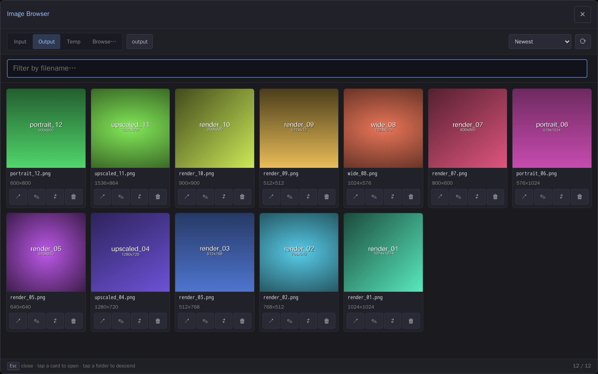

# comfyui-image-browser

Full-canvas file explorer for browsing and managing images across ComfyUI's input, output, temp and arbitrary paths — thumbnails plus delete, rename and move.

> Part of a family of mobile-first ComfyUI usability packs
> ([gallery-loader](https://github.com/laurigates/comfyui-gallery-loader),
> [sampler-info](https://github.com/laurigates/comfyui-sampler-info)):
> touch-friendly HTML modals launched from the toolbar/command palette
> that replace clunky native LiteGraph dialogs, additive and self-contained.



*The full-canvas browser, opened from the top-bar button — thumbnails of the
Output folder with per-card manage actions.*

## Install

```sh
cd <ComfyUI>/custom_nodes
git clone https://github.com/laurigates/comfyui-image-browser
cd comfyui-image-browser
bun install
bun run build      # emit web/dist/ (served by ComfyUI)
```

Restart ComfyUI; hard-refresh the browser tab (Ctrl+Shift+R / Cmd+Shift+R).

## What it does

Adds an **Image Browser** button to the ComfyUI top bar (also a command in the
palette and an **Extensions → Image Browser** menu entry). Clicking it opens a
**full-viewport** file explorer that stands in for the canvas while open — a
touch-first card grid of thumbnails you can browse and manage without leaving
ComfyUI.

- **Browse** the **Input / Output / Temp** folders as tabs, plus a **browse…**
  tab for arbitrary absolute paths (`models/`, `custom_nodes/`, anywhere on
  disk). Breadcrumbs, folder descend, sort (newest / oldest / name / size /
  resolution), and fuzzy filename filter.
- **Thumbnails** for images (WebP previews) and videos (poster frames), lazily
  loaded as you scroll. Tap a card to open the full-size file in a new tab.
- **⤓ Load workflow** (`w`) — reopen the graph embedded in a file, on any tab
  including `browse…`. ComfyUI writes the workflow into every image *and video*
  it saves, so this turns the browser into a durable way back into a past
  generation — unlike the stock sidebar, whose list is cleared on every ComfyUI
  restart. Files re-encoded elsewhere (a phone gallery, a chat app) lose that
  metadata, and the button says so rather than failing silently.
- **ⓘ Metadata** (`i`) — the prompt, model, seed, steps, CFG, sampler and
  scheduler read back out of the file, each copyable, with the full raw
  metadata behind a disclosure.

  Both work on **videos** as well as images: MP4/MOV/M4V and WebM/MKV are read
  natively, including clips written by `WanVideoWrapper` and other custom
  savers whose metadata layout ComfyUI's own loader does not understand.
  (`.avi`/`.mpg` carry no ComfyUI metadata, so they show neither button rather
  than one that fails on tap.)
- **Manage** files in the sandboxed roots (Input / Output / Temp):
  - **🗑 Delete** — with a confirm step.
  - **✎ Rename** — in place (extension preserved).
  - **⇄ Move** — into another root or subfolder via a destination picker.

### Star ratings on ComfyUI's own Media Assets sidebar

Ratings are stored in each image's **XMP** (or a sidecar), so they are a
property of the file rather than of this pack. That makes them worth showing
where you actually look at a fresh generation — ComfyUI's stock **Media
Assets** sidebar — and not only inside the browser.

Enabled by default; switch it off under **Settings → Image Browser → Sidebar**.

ComfyUI exposes no extension point for media-asset cards (`ComfyExtension` has
hooks for commands, menus, settings, sidebar *tabs* and canvas/node context
menus — nothing per card, and `MediaAssetCard.vue` has no slot), so this is a
deliberate, contained DOM injection. It is written to fail soft: if a frontend
update changes the card markup, the stars simply stop appearing — they never
throw, and never intercept the card's own clicks. The setting is the kill
switch if a future version misbehaves.

Note that the sidebar's own list is cleared whenever ComfyUI restarts. The
ratings are not — they are on disk, so anything you star there is still starred
in the Image Browser afterwards.

Management actions are intentionally **disabled in the arbitrary-path
(`browse…`) tab** — that mode is browse-only. The backend rejects writes outside
the Input/Output/Temp roots, so an arbitrary path can never be mutated by URL
crafting. See the security posture in `docs/blueprint/adrs/0002-*`.

## Compatibility

- ComfyUI: modern Vue frontend (`comfyui-frontend-package >= 1.40`) for the
  `registerExtension` action-bar/command launcher API.
- Frontend changes take effect after `bun run build` + a browser hard-refresh —
  no ComfyUI restart.

## License

MIT — see `LICENSE`.
